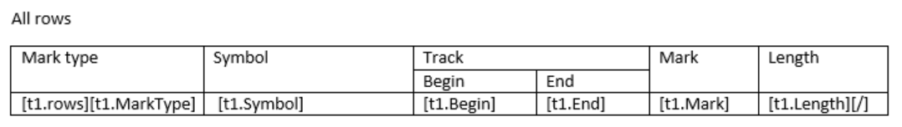
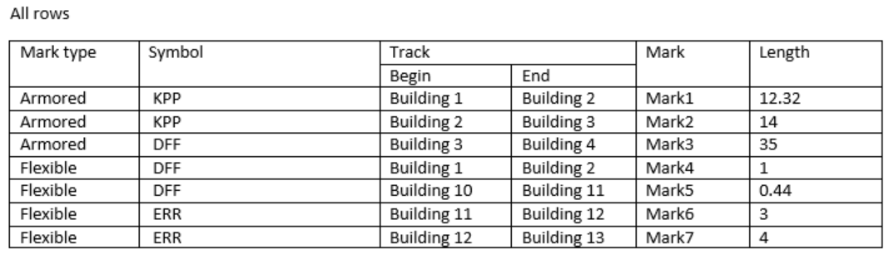

# DocumentsGenerator
Fast generator open xml documents from template. Handle document parts: header, footer and body.

Create template by word processor. Use special tags for data management.
### Available tags:
- Value
- Rows
- GroupRows
- ExistIf

### Properties of tags:
- Condition
- Fit
- GroupCount
- Group
- Index
- OneString
- RemoveEmpty
- RowSpan
- Split
- Sum

See demonstration application for basic using.

#### For example.

##### 1. Create data set.
``` 
var dataSet = new DataSet();
var table = new DataTable()
{
    TableName = "t1"
};
dataSet.Tables.Add(table);

table.Columns.Add("MarkType", typeof(string));
table.Columns.Add("Symbol", typeof(string));
table.Columns.Add("Begin", typeof(string));
table.Columns.Add("End", typeof(string));
table.Columns.Add("Mark", typeof(string));
table.Columns.Add("Length", typeof(double));

table.Rows.Add("Armored", "KPP", "Building 1", "Building 2", "Mark1", 12.32);
table.Rows.Add("Armored", "KPP", "Building 2", "Building 3", "Mark2", 14);
table.Rows.Add("Armored", "DFF", "Building 3", "Building 4", "Mark3", 35);
table.Rows.Add("Flexible", "DFF", "Building 1", "Building 2", "Mark4", 1);
table.Rows.Add("Flexible", "DFF", "Building 10", "Building 11", "Mark5", 0.44);
table.Rows.Add("Flexible", "ERR", "Building 11", "Building 12", "Mark6", 3);
table.Rows.Add("Flexible", "ERR", "Building 12", "Building 13", "Mark7", 4);
```
    

##### 2. Prepare template in open xml format.




##### 3. Generate document by template and data set.

```
var dataSet = new DataSet();
            
// create tables with data

var templateFile = @"c:\template.docx";
var generator = new WordGenerator(templateFile, dataSet);
generator.Generate();
```

##### 4. Result.

